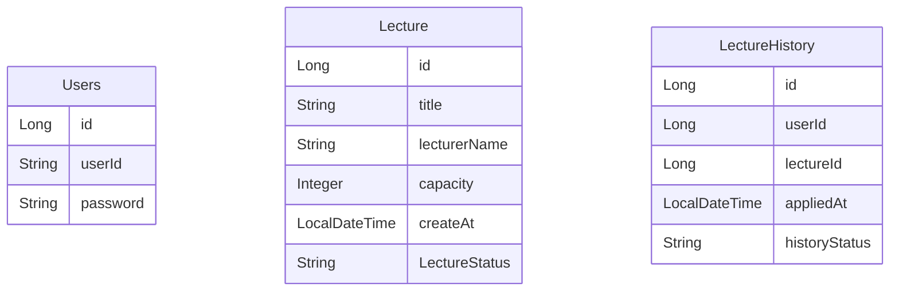

# 테이블 설계

---

## ERD

## 설계 개요
각 테이블이 서로 간에 직접적인 연관 관계를 갖지 않는 독립적인 구조로 설계되었습니다.

## 장점
### 독립성
테이블 간의 직접적인 관계를 설정하지 않음으로써 각 테이블은 독립적인 엔티티로 유지됩니다.
예를 들어, Users 테이블에 변화가 생기더라도 Lecture나 LectureHistory에 직접적인 영향을 미치지 않으므로 더 유연한 데이터베이스 구조를 유지할 수 있습니다.

### 유연성
연관 관계가 없는 설계를 선택함으로써 비즈니스 로직을 애플리케이션에서 유연하게 처리할 수 있습니다. 예를 들어, LectureHistory와 Lecture가 외래 키로 강하게 연결되지 않음으로 인해 사용자는 원하는 방식으로 데이터를 추가, 수정, 삭제할 수 있으며, 다양한 데이터 소스에서 정보를 통합하는 작업이 수월해집니다. 이는 변경되는 요구사항에 맞춰 빠르게 대응해야 하는 비즈니스 환경에서 큰 장점이 될 수 있습니다.

### 확장성
애플리케이션이 성장하면서 데이터 모델이 점점 더 복잡해질 수 있습니다. 테이블 간의 연관 관계를 최소화하면 미래에 새로운 요구사항에 맞춰 테이블을 쉽게 확장하거나 리팩토링할 수 있습니다. 관계를 나중에 필요에 따라 애플리케이션 레벨에서 처리하거나 새로 정의할 수 있으며, 이로 인해 시스템이 확장성을 유지하는 데 유리한 구조를 가질 수 있습니다.

## 결론
성능, 유연성, 확장성을 고려하여 테이블 간에 명시적인 외래 키 관계 없이 독립적으로 구성되었습니다.
이 방식은 특정 비즈니스 요구 사항과 데이터베이스의 성능을 최적화하는 데 유리하며,
관계를 애플리케이션 레벨에서 처리하여 데이터베이스 구조의 유연성을 높입니다.
