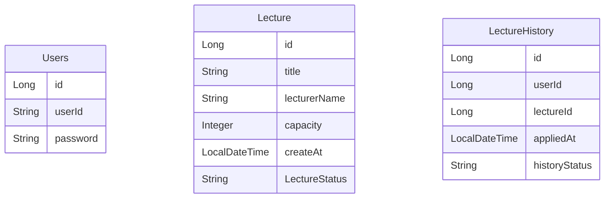

# ERD

```mermaid
erDiagram
    Users {
        Long id
        String userId
        String password
    }
    
    Lecture {
        Long id
        String title
        String lecturerName
        Integer capacity
        LocalDateTime createAt
        String LectureStatus
    }

    LectureHistory {
        Long id
        Long userId
        Long lectureId
        LocalDateTime appliedAt
        String historyStatus
    }

```